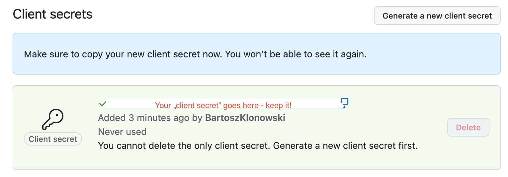

<h1 align="center"> OAuth2.0 with React Native<br/>(Tutorial)</h1>

This repository presents the step-by-step (commit-by-commit) tutorial on how to create a basic mobile (iOS, Android) application with authorization using OAuth2.0 and React Native.

Application created during this tutorial will be able to connect to your own GitHub profile using OAuth2.0.
<br/>This application uses React Native v0.74, but you can upgrade the version (if cloning/forking this repo) or you can select other version when creating the initial application (if following steps from tutorial).

Let's get started:

## 1. Create the initial application ([`a279212`](https://github.com/BartoszKlonowski/oauth-with-react-native-tutorial/commit/a27921290ee8a647d8e7ecf5b981c4cacc8ff298))

To create the initial application let's follow the official steps from React Native docs, [here](https://reactnative.dev/docs/getting-started-without-a-framework).

What we did, however was to move the `App.tsx` file to `src/` directory and get rid of all the boilerplate code that was in it.

Let's launch the app on both platforms to make sure everything is OK to start with.

## 2. Let's implement screens and navigation ([`bce17fe`](https://github.com/BartoszKlonowski/oauth-with-react-native-tutorial/commit/bce17fea2dd1237ea3a616f224703ce532edc5df))

For the best experience let's split the application into screens. For that, we will install [React Navigation](https://reactnative.dev/docs/navigation#react-navigation) and [React Native Screens](https://docs.swmansion.com/react-native-screens/) following the steps described in [Installation and Setup](https://reactnative.dev/docs/navigation#installation-and-setup) section of React Native documentation:

In our terminal, let's type those in presented order:

```
npm install @react-navigation/native @react-navigation/native-stack
npm install react-native-screens react-native-safe-area-context
cd ios; pod install; cd ..
```

Once we have our setup ready, let's create new screen:

```tsx
const Login = (): JSX.Element => {
  const [authCode, setAuthCode] = useState("");
  const [accessToken, setAccessToken] = useState("");

  return (
    <View style={styles.mainContainer}>
      <Button onPress={() => {}} title='Authorize'/>
      <View style={styles.tokenResultContainer}>
        <Text>Authorization code is:</Text>
        <Text>{authCode}</Text>
        <Text>Access token is:</Text>
        <Text>{accessToken}</Text>
      </View>
    </View>
  );
}
```

We creted two states: `authCode` - to present the temporary authorization code received from the service, and `accessToken` - to present the token received at the end of authorization, that should be used to access the API. 

Having that, let's also modify our `App.tsx` file to utilize the navigation and screens:

```diff
 function App(): JSX.Element {
   return (
-    <View style={styles.mainContainer}>
-      <Text>OAuth2.0 with React Native</Text>
-    </View>
+    <NavigationContainer>
+      <Stack.Navigator>
+        <Stack.Screen
+          name="Login"
+          component={Login}
+          options={{title: 'Login using OAuth2.0'}}
+        />
+      </Stack.Navigator>
+    </NavigationContainer>
   );
 }
```

You can we that we also created the `navigation.ts` file to keep all the props of our navigation tree and props of our screens, but for implementation details please see the official [React Navigation documentation](https://reactnavigation.org/docs/typescript/).

## 3. Setting up the OAuth app on GitHub

Now to the interesting part - we will create and set up the OAuth app on our GitHub profile.
<br/>Enter the developer settings of your GitHub profile and select "OAuth Apps" and "New OAuth App" on the right:


Next, fill the fields of your new OAuth app:


Few words of explanation:

* We didn't use the [device flow](https://docs.github.com/en/apps/oauth-apps/building-oauth-apps/authorizing-oauth-apps#device-flow), as we just don't need it.
* The `Authorization callback URL` is the URL that will be used by the service to send back the temporary authorization code. This needs to be the deeplink that will lead to our application.

Let's go ahead and click the "Register application" button on the bottom. Our app is now registered on our GitHub account and we can view it's details, including the ClientID, which we will use in further steps.

## 4. Requesting and accessing temporary authorization code ([`9865f56`](https://github.com/BartoszKlonowski/oauth-with-react-native-tutorial/commit/9865f5627b3c5a6f9ebfac79e0da75117ac1bf10))

Now we will focus on getting the temporary authorization code that we will receive from the GitHub service app that we just registered.

Looking at the OAuth2.0 flow diagram (taken from the official [OAuth documentation](https://datatracker.ietf.org/doc/html/rfc6749#section-1.2)) we will focus on the selected part, including phase `A` and `B`.


(Note that `Client` is our mobile application we develop)

To achieve that, let's set up the deeplinking for both platforms and provide our `Login` screen component with:
* `handleAuthorization` callback - it's responsibility is to gather the request parameters (`clientID` and `redirect_uri`) and send them to the GitHub authorization URL: `"https://github.com/login/oauth/authorize"` (note this is universal, independent of user or an app, etc.).
<br/>This callback implements the `(A)` part of the presented diagram.
* an effect with adding event listener - it's responsibility is to listen for any incoming connections where `url` will contain our authorization code.
<br/>This effect implements the part `(B)` of the diagram.
<br/>In our case, the response will look like:
<br/>`oauthwithreactnativetutorial://code?code=23ee33eeed5eff231705`
and the `code=` is the part, where we get the temporary authorization code and store it in our state.

In part `(A)` the application will open a web browser with GitHub authorization site asking for our credentials. After providing those, we will be redirected back to our app, as part of part `(B)` with the temporary code.

Go ahead and rebuild the app to test, whether after successful authorization temporary code will be displayed.

## 5. Requesting and accessing the access token ([`5f6f310`](https://github.com/BartoszKlonowski/oauth-with-react-native-tutorial/commit/5f6f3107d0fd57aca73dd2aad4c41532595c9de4))

Our temporary authorization code last only 10 minutes (at the time writing this), so after receiving it we want to send it back to `Authorization Server` to exchange it to the access token:


To do that, we now need need to use our client secret from GitHub, so to create one for our application let's enter our app once again in GitHub's profile's developer settings and (by clicking "Edit") enter it's properties. We should see the section with "Client secrets". Let's create that secret and copy-paste so we can store it somewhere safe.



In our simple application we will keep it as another `const` right next to `client_id`

```diff
 const client_id = "Your clientID goes here";
+const client_secret = "Your client secret goes here";
```

Once we have it, we can use it to send back the temporary authorization code in a request for access token by sending POST to:
`https://github.com/login/oauth/access_token` url.

This is achieved by `requestAccess` callback, which implements the POST handling. It is important to specify the response type as `token` and `Content-Type` as `'application/json'` so that we can convienently parse the access token embedded in the response.

Once we have that callback implemented, we can call it directly after the temporary authorization code is received. We do that, to keep the flow under one button click in our app:

```diff
   useEffect(() => {
     Linking.addEventListener('url', ({ url }) => {
       const temporaryToken = url.split("?")[1].split("=")[1];
       setAuthCode(temporaryToken);
+      requestAccess(temporaryToken);
     });
     return () => {
```

After the call is successful we should see the access code displayed in the login screen, stored in our `accessToken` state, ready to be used for fetching the API.

## 6. Fetching the GitHub API and displaying the profile ([`4831cae`](https://github.com/BartoszKlonowski/oauth-with-react-native-tutorial/commit/4831caefd43499329f6b7d2852565689b6ce4669))

In the last part we will fetch and then display our GitHub profile we now have access to by having the access token received.
<br/>This will implement the last two parts of OAuth diagram: `(E)` and `(F)`:


To fetch the data we will implement the `handleAPIFetch` callback, which is rather simple, as it only fetches the data from `"https://api.github.com/user"`, but what is important is to pass the `accessToken` in the `Authorization` field of the `GET` method header:

```javascript
      headers: {
        Accept: 'application/json',
        'Content-Type': 'application/json',
        "Authorization": `token ${accessToken}`
      },
```

We will launch this callback automatically as soon as both `authCode` and `accessToken` states are settled:

```javascript
  useEffect(() => {
    if (authCode && accessToken) {
      handleAPIFetch();
    }
  }, [authCode, accessToken]);
```

Once we have the `profile` in our state we can render the `Log in` button, which will navigate to the [`Profile`](./src/screens/Profile.tsx) screen:

```diff
@@ -78,6 +106,9 @@ const Login = (): JSX.Element => {
         <Text>Access token is:</Text>
         <Text>{accessToken}</Text>
       </View>
+      {authCode && accessToken && profile ? <Button onPress={() => {
+          navigation.navigate('Profile', profile);
+        }} title="Log in" /> : null}
     </View>
   );
```

We separated the authorization from navigation into two buttons only to be able to see both temporary code and access token displayed in the middle of the authorization process. In production-ready application it is good to handle whole flow in a single call to action.

Once we are navigated to the Profile screen we should see the GitHub profile data rendered.

## Materials, knowledge and see also

- [Authorizing OAuth apps](https://docs.github.com/en/apps/oauth-apps/building-oauth-apps/authorizing-oauth-apps)
- [OAuth 2.0 official docs](https://oauth.net/2/)
- 
